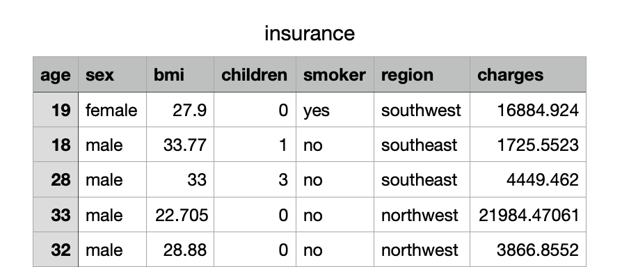

# Predicting Health Insurance Costs

## Segment 1 Roles & Responsibilities

* Massimo - Data Engineer
* Roza - Data Scientist
* Mark - Project Manager / GitHub Cleanup
* Sandy - Readme Management / Project Description Write Up

## Background & Rationale

It is well known that how much an individual pays for insurance policies are very case dependent. One person may be paying a lot more than another due to seemingly unknown factors. In the case of health insurance, various lifestyle situations such as being a smoker, having more than one child or even the region you live in has an impact on how much you are charged. 

Therefore, in this project, we set out to create a machine learning algorithm to predict health insurance charges. This knowledge would benefit both insurers and beneficiaries. 

## Research Questions

There are two main questions we wanted to answer in this endeavour: 
1) What model is most predictive of how much someone is charged for health insurance? 
2) What factors in this dataset are most influential of how much someone is charged for health insurance? 

## Dataset 

There are seven columns in this dataset: 
* Age: Age of the primary beneficiary
* Sex: Male or Female
* BMI: Body Mass Index of the primary beneficiary
* Children: Number of children covered by health insurance / number of dependents
* Smoker: Smoking status, either Yes or No 
* Region: The US resedential area: Northeast, Northwest, Southeast or Southwest
* Charges: Individual medical costs billed by health insurance 

